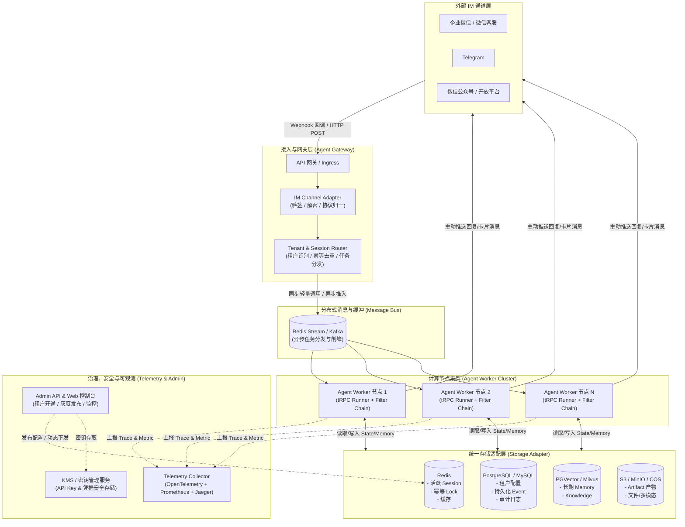
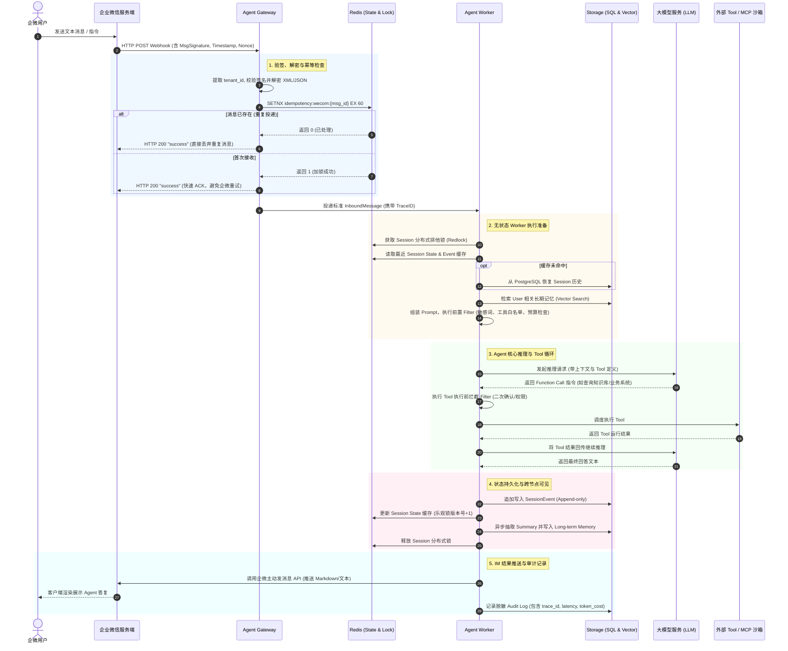
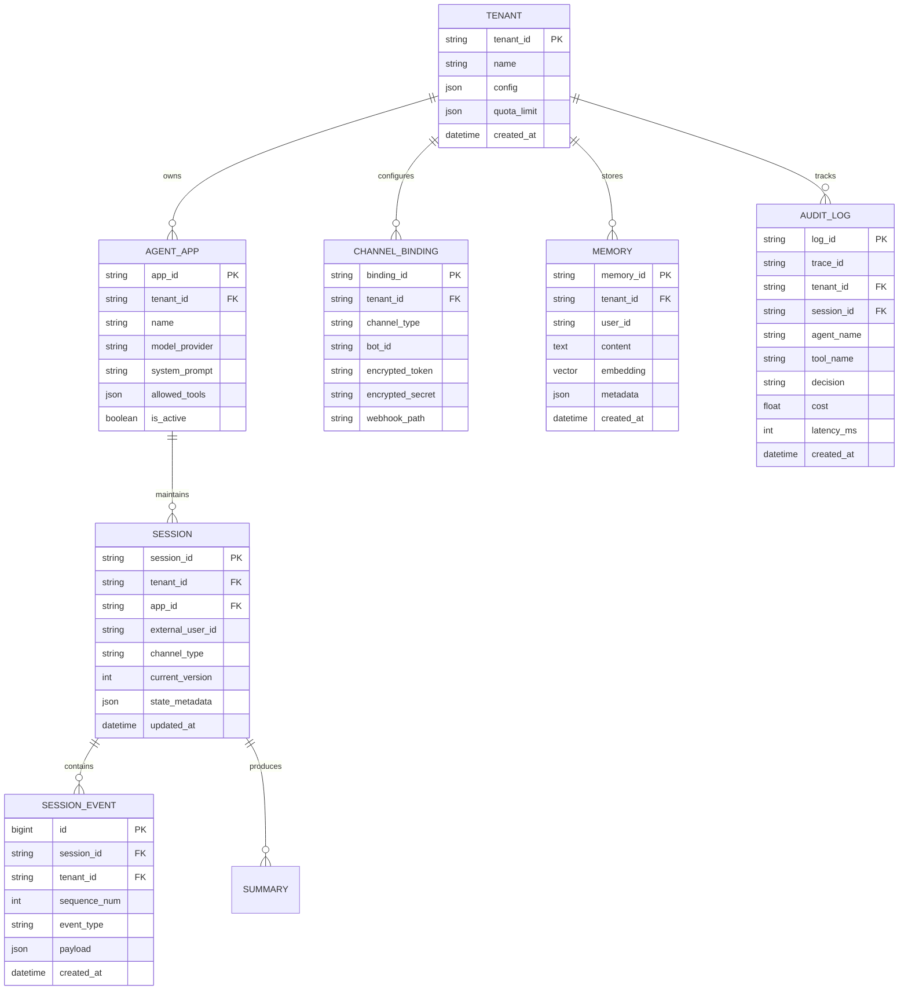
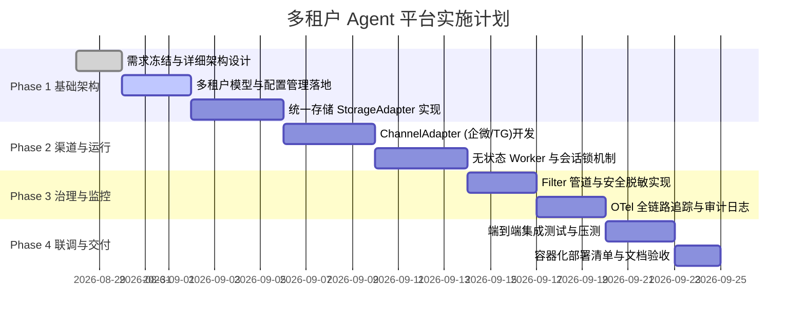

# 基于 tRPC-Agent 的多租户节点化 Agent 部署平台方案设计

## 1. 项目背景与设计思路

### 1.1 背景与业务痛点
随着企业大模型应用的深入，Agent 已从单点实验性 Demo 走向多业务线、多部门规模化落地阶段。企业在构建生产级 Agent 平台时普遍面临以下痛点：
1. **多租户隔离困难**：不同业务线要求独立配置大模型参数、专属工具集（Tool/MCP）、独立会话记忆与知识库，同时必须保证数据、密钥与权限的安全硬隔离。
2. **算力与会话状态耦合**：传统 Agent 服务常将会话状态常驻内存，导致节点无法平滑弹性伸缩，单节点宕机引发会话丢失。
3. **IM 生态接入碎片化**：企业微信、微信客服、公众号、Telegram 等多渠道协议不一、超时机制严苛（如微信 5 秒超时）、消息重试乱序，缺乏标准通道适配层。
4. **多存储后端需求多样**：不同租户根据成本和性能诉求，对会话、向量记忆、审计日志有着差异化后端诉求（如 Redis vs SQL vs 向量库），需要解耦与热插拔能力。
5. **合规审计与成本治理**：大模型调用成本高昂、存在越权风险，缺乏细粒度的 Token 预算、工具白名单、敏感信息脱敏和全链路 Trace 追踪能力。

### 1.2 设计思路与核心原则
本平台基于 **tRPC-Agent** 框架构建，遵循以下五大核心设计原则：
- **控制面与数据面分离（Control & Data Plane Separation）**：管理面负责租户、应用、路由规则与密钥治理；数据面专注于低延迟、高并发的 Agent 运行与消息流转。
- **计算节点完全无状态（Stateless Workers）**：Worker 节点不维持任何会话上下文，所有状态委托给分布式 Storage Adapter，实现秒级水平伸缩（HPA）。
- **统一渠道抽象与协议归一（Unified Channel Abstraction）**：统一封装 IM 鉴权、验签、重试去重、流式消息切片及长耗时异步回调机制。
- **分层多租户隔离（Hierarchical Tenant Isolation）**：从请求路由、运行时 Filter、存储命名空间到审计日志，全链路注入 `tenant_id` 与安全上下文。
- **插拔式数据适配器（Pluggable Storage Adapters）**：抽象统一存储协议，支持 Redis、关系型数据库（PostgreSQL/MySQL）、向量库（PGVector/Milvus）与对象存储（S3/COS）灵活组合。

---

## 2. 总体架构与系统拓扑

### 2.1 节点部署拓扑架构图

平台主要由 **Agent Gateway**、**Agent Worker 集群**、**Channel Adapter**、**Storage Adapter**、**Admin API** 以及 **Telemetry Collector** 六大核心组件协同工作：



### 2.2 核心组件协作职责

1. **Agent Gateway**：
   - 暴露统一 Webhook 入口，处理各 IM 渠道的回调请求。
   - 解析 URL Path / Headers 识别 `tenant_id`，校验 IM 签名与时间戳。
   - 执行全局幂等去重，过滤重复推送；构建标准格式消息包。
   - 对于长耗时任务快速返回 ACK（满足微信 5 秒机制），将任务派发至 Worker 或消息队列。
2. **Channel Adapter**：
   - 将不同 IM 的非结构化/专有格式报文转换为系统内部标准的 `AgentInboundMessage`。
   - 将 Agent 产生的事件流（Text Chunk、Tool Calls、Final Answer）适配回 IM 支持的 Markdown、卡片消息或分块文本。
3. **Agent Worker 集群**：
   - 执行 tRPC-Agent 编排引擎、Runner 执行循环。
   - 运行租户专属 Filter 链（权限检查、敏感词过滤、预算控制）。
   - 动态调度 Tool / MCP 沙箱工具。
   - 节点完全无状态，支持按 CPU / GPU / 消息积压数自动弹性扩缩容。
4. **Storage Adapter**：
   - 屏蔽底层存储异构性，提供统一的 CRUD 与 Vector Search 接口。
   - 处理 Session 分布式锁、增量 Event Append、Memory 向量持久化。
5. **Admin API & Telemetry**：
   - 提供多租户管理、模型路由规则、工具授权、配额统计等管理面功能。
   - OpenTelemetry 收集端到端 Distributed Trace，Prometheus 暴露指标，ELK/Loki 归集审计日志。

---

## 3. 核心业务时序全链路设计

以下展示“**企业微信用户发送消息 $\rightarrow$ 网关验签去重 $\rightarrow$ Worker 加载上下文 $\rightarrow$ Tool 执行 $\rightarrow$ 状态写回 $\rightarrow$ 异步推送企微回复**”的完整时序图：



---

## 4. 重点技术方案深度设计

### 4.1 多租户隔离机制与安全设计

平台支持四层立体化隔离体系：

| 隔离维度 | 隔离策略 | 技术实现机制 |
| :--- | :--- | :--- |
| **配置隔离** | 租户级热配置、动态分发 | 每个租户拥有独立的 `TenantConfig` 实体，存储于 SQL 并缓存于 Redis Hash `tenant:config:{tenant_id}`。变更通过 Pub/Sub 触发 Worker 本地缓存热刷新。 |
| **数据隔离** | 逻辑隔离（默认）/ 物理隔离（专享） | - 默认：所有核心表均强制包含 `tenant_id`，DAO 层通过租户拦截器自动注入 `WHERE tenant_id = :tid`，并在 DB 层面建立联合索引。<br>- 专享：支持高合规租户配置独立 Database / Redis 实例连接池。 |
| **工具与沙箱隔离** | 基于 Filter 的 RBAC 与沙箱 | 租户配置中声明 `allowed_tools` 列表；危险工具（如执行代码、转账）配置 `require_confirmation`。沙箱执行隔离在独立 gRPC/MCP 容器中。 |
| **密钥管理与日志脱敏** | KMS 加密与动态运行时注入 | - 数据库中仅存对称加密密文（KMS 加解密）。<br>- 日志系统与 OpenTelemetry Span 接入 `MaskingFilter`，自动针对 API Key、Token、身份证、手机号进行正则脱敏。 |

### 4.2 无状态 Worker 与分布式会话一致性

为了实现 Worker 节点随负载无损水平扩展，平台**坚决摒弃粘性会话（Sticky Session）**，采用“**共享状态层 + 乐观锁版本号 + 追加事件日志**”架构：
1. **多节点并发写入同一会话一致性**：
   - 网关层收到同一个 `session_id` 的并发请求时，Worker 首先尝试获取 Redis 分布式锁：`lock:session:{session_id}`（TTL 30s）。
   - 获取成功的 Worker 独占执行该会话推理；未获取成功的请求根据策略进入排队等待（最长等待 3s）或返回“正在思考中，请稍候”。
2. **状态更新顺序（Order of Write）**：
   - 严格遵循：**`Append SessionEvent` $\rightarrow$ `Update SessionState`（带 `version = version + 1` 乐观锁检查）$\rightarrow$ `Async Background Summary & Memory Embedding`**。
   - 避免直接覆盖更新会话历史，保证历史轨迹不可变且可精准重放（Event Sourcing）。
3. **跨节点 Memory 可见性**：
   - Memory 写入完成后，立即写入集中式向量存储（PGVector / Milvus），并清除/刷新 Redis 层的会话缓存，使得任意后续被调度到其他 Worker 节点的请求均能拉取最新状态。

### 4.3 IM 渠道接入与会话映射体系

#### 4.3.1 会话 ID 生成与隔离规则
针对不同渠道与场景，制定结构化的 `session_id` 规范，防止跨群、跨租户串话：
- **企业微信 / Telegram 单聊**：`{tenant_id}:{channel}:direct:{external_user_id}`
- **企业微信 / Telegram 群聊**：`{tenant_id}:{channel}:group:{chat_id}`
  - 在群聊上下文事件中，在 Event 元数据中单独附带 `sender_id`，以区分群内不同发言人，而会话共享群内公共上下文。
- **临时 / 独立任务会话**：`{tenant_id}:{channel}:task:{task_id}`

#### 4.3.2 渠道适配差异与限制处理

| 渠道名称 | 鉴权与验签 | 消息限制与分片 | 超时机制与回复模式 | 特色能力适配 |
| :--- | :--- | :--- | :--- | :--- |
| **企业微信 (WeCom)** | URL 携带 `msg_signature`, `timestamp`, `nonce`，AES 加解密 XML 消息体 | 文本 $\le 2048$ 字节，Markdown $\le 4096$ 字节。超出自动进行句子感知切片。 | 5 秒内必须返回 HTTP 200，否则重试 3 次。采用 **快速 ACK + 异步调用主动推送接口**。 | 支持卡片消息、审批卡片、附件上传接口。 |
| **Telegram** | Bot Token 校验，Webhook URL 携带独立 `secret_token` Header 校验 | 文本 $\le 4096$ 字符。支持 MarkdownV2 与 HTML 格式。 | 支持直接在 Webhook HTTP 响应中返回回复，或调用 `sendMessage` 异步推送。 | 原生支持流式打字状态（`sendChatAction: typing`）与 Inline Keyboard。 |
| **微信客服 / 公众号** | 微信服务器 Token/Signature 校验，XML/JSON 协议格式 | 文本 $\le 600$ 字符。 | 5 秒超时必须回复。超过 5 秒使用客服消息接口异步推送。 | 48 小时内互动窗口限制。 |

### 4.4 数据存储抽象与多后端适配策略

平台通过 `StorageAdapter` 抽象类定义标准行为：

```python
class BaseStorageAdapter(ABC):
    # Session & Event 接口
    async def get_session(self, tenant_id: str, session_id: str) -> Optional[Session]: ...
    async def append_events(self, tenant_id: str, session_id: str, events: List[SessionEvent], expected_version: int) -> bool: ...
    
    # Memory & Knowledge 向量检索接口
    async def add_memory(self, tenant_id: str, user_id: str, memory_item: MemoryItem) -> str: ...
    async def search_memory(self, tenant_id: str, user_id: str, query_embedding: List[float], top_k: int) -> List[MemoryItem]: ...
    
    # 审计日志接口
    async def record_audit_log(self, log_entry: AuditLogEntry) -> None: ...
```

#### 4.4.1 多后端存储职责与一致性取舍

| 存储后端 | 负责存储的数据类型 | 一致性模型 | 读写延迟 | 成本 & 运维复杂度 | 适用场景 |
| :--- | :--- | :--- | :--- | :--- | :--- |
| **Redis** | Active Session State, 分布式锁, 幂等缓存 | 强一致（单分片） | $< 2\text{ms}$ | 成本较高，运维简单 | 支撑高并发在线对话上下文与互斥锁 |
| **PostgreSQL / MySQL**| 租户配置, 持久化 Session Events, Audit Log | 强一致（ACID） | $5 \sim 20\text{ms}$ | 成本适中，成熟可靠 | 生产核心事实数据、元数据与审计落盘 |
| **PGVector / Milvus** | 长期 Memory, 租户 Knowledge 片段 | 最终一致 | $10 \sim 50\text{ms}$ | 成本适中，需索引维护 | 用户画像记忆、知识库 RAG 向量检索 |
| **S3 / MinIO / COS** | Tool 生成的文件、图片、导出报表 (Artifacts) | 最终一致 / 读写后一致 | $20 \sim 100\text{ms}$ | 极低成本，海量扩展 | 大文件、多模态媒体产物持久化 |

#### 4.4.2 数据平滑迁移方案 (如 Redis $\rightarrow$ SQL, 本地向量 $\rightarrow$ 远端向量)
1. **双写与版本标记（Dual-Write Phase）**：在 Storage Adapter 层开启双写开关，新数据同时写入旧后端与新后端；
2. **全量历史回放（Backfill Migration）**：后台异步批处理任务将旧后端历史数据按 `tenant_id` 顺序搬迁至新后端；
3. **读切换与校验（Read Switch & Verify）**：比对新旧后端抽样数据一致性，确认无误后将读流量切换至新后端；
4. **下线旧后端（Decommission）**：关闭旧后端写入，完成无缝热迁移。

### 4.5 治理、安全与可观测性体系

```
[IM Webhook] (生成 trace_id)
      │
      ▼
[Channel Adapter] (注入 Span: im_ingress)
      │
      ▼
[Filter Pipeline] (Span: filter_chain_eval)
  ├─ TenantQuotaFilter (Token/请求预算校验)
  ├─ ToolPermissionFilter (工具白名单)
  ├─ SensitiveDataMaskFilter (输入/输出正则脱敏)
  └─ HumanInTheLoopFilter (危险工具二次确认)
      │
      ▼
[tRPC Runner] (Span: agent_execution)
  ├─ LLM Call (Span: llm_generate, 记录 Prompt Token & Latency)
  └─ Tool Call (Span: tool_invoke, 记录 ToolName & Error)
      │
      ▼
[Storage & IM Reply] (Span: state_persist & im_egress)
      │
      ▼
[Audit Log Dispatcher] (输出标准化 JSON 审计日志，上报 Elasticsearch)
```

- **OpenTelemetry 全链路追踪**：Trace Context 在 HTTP Headers / 消息体元数据中持续透传，打通 `IM Webhook` $\rightarrow$ `Runner` $\rightarrow$ `LLM Call` $\rightarrow$ `Tool Execution` $\rightarrow$ `Storage IO` $\rightarrow$ `IM Callback`。
- **审计日志核心规范**：
  ```json
  {
    "trace_id": "c4b12398a0f948a9b2",
    "timestamp": "2026-08-27T22:15:30Z",
    "tenant_id": "tenant_fin_dept",
    "channel": "wecom",
    "user_id": "zhangsan",
    "session_id": "tenant_fin_dept:wecom:direct:zhangsan",
    "agent_name": "FinanceAssistant",
    "tool_name": "query_salary_db",
    "decision": "ALLOWED",
    "prompt_tokens": 1280,
    "completion_tokens": 350,
    "cost_usd": 0.0048,
    "latency_ms": 1420,
    "error_type": null
  }
  ```

---

## 5. 核心数据模型设计 (Data Model)



---

## 6. 生产故障恢复与运维高可用

### 6.1 故障降级与容灾策略矩阵

| 故障场景 | 检测机制 | 自动降级与恢复对策 |
| :--- | :--- | :--- |
| **Agent Worker 节点宕机** | K8s Liveness Probe / 心跳超时（10s） | Gateway 自动剔除坏节点，将排队任务自动重试分发至存活 Worker；由于状态在 Storage，新节点无缝接管。 |
| **模型服务限流 / 超时 (429/504)** | Exponential Backoff 重试 3 次失败 | 触发模型路由降级：切换到备用模型厂商（如主 DeepSeek $\rightarrow$ 备 Qwen），若均失败则返回友好兜底文案并告警。 |
| **IM 通道发送失败 / 频控** | 捕获 HTTP 429 / 网络异常 | 消息入 Redis Retry 延迟队列（1s, 3s, 5s 递增重试），三次失败后记录死信队列（DLQ）并触发运维告警。 |
| **Redis 主节点短时故障** | Redis Sentinel / Cluster 自动主从切换 | 启用内存临时 Buffer 缓冲 Session 更新，等待连接恢复后批量 Flush，降级期间单聊降级为短记忆模式。 |
| **工具/沙箱执行超时或崩溃** | Worker 设工具超时时间（如 15s） | 捕获 TimeoutException，向 LLM 注入“工具调用超时错误”，让模型自主生成降级答复，避免 Worker 线程悬挂。 |

### 6.2 灰度发布与配置回滚机制
- **租户级灰度**：通过在 `ChannelBinding` 或 Gateway 路由表配置 `traffic_split` 规则（如 90% 流量走 Worker-v1，10% 走 Worker-v2），支持按 `user_id` Hash 或指定测试群进行灰度验证。
- **动态配置秒级回滚**：租户配置在 Admin DB 中保留版本快照（`ConfigVersion`），回滚只需修改 Pointer 指向历史版本，Redis 发布广播事件刷新各 Worker 内存配置缓存。

### 6.3 容量评估与基准参考 (以 1000 活跃 Session 峰值估算)
- **单 Worker 节点容量**：基于 Python 异步协程，每个 4C8G 节点可维持并发推理 100~150 QPS。
- **存储吞吐要求**：
  - Redis：峰值 QPS $\approx 5000$，内存占用 $\approx 2\text{GB}$（活跃会话 7 天 TTL）。
  - SQL：写 QPS $\approx 800$，读 QPS $\approx 1200$。
- **IM 回调峰值缓冲**：Gateway 边缘配置 2000 QPS 漏桶限流，溢出部分进入队列平滑消费。

---

## 7. 生产风险清单与缓解对策 (8 大风险)

| 序号 | 潜在生产风险 | 风险影响等级 | 具体缓解与防御措施 |
| :---: | :--- | :---: | :--- |
| **1** | **IM 消息重复投递导致并发脑裂** | 高 (严重) | Gateway 采用 `SETNX` 消息级全局幂等锁；Worker 采用 `Redlock` 会话级互斥锁，保障消息有序串行处理。 |
| **2** | **租户 Token 超支引发天价账单** | 高 (严重) | 引入 `TenantQuotaFilter`，设置按日/按月 Token 预算上限；达到 80% 触发预警，达到 100% 自动熔断降级为轻量模型或拦截。 |
| **3** | **Prompt 注入 / 越权执行危险工具** | 极高 (致命) | 双层防护：LLM 提示词安全防护 + 运行时 Filter 工具白名单强校验，高危工具必须经由人工二次确认。 |
| **4** | **微信 5 秒超时导致频繁重试与雪崩** | 高 (严重) | 架构强制要求 Gateway 接收消息后立即 ACK 响应 HTTP 200，执行逻辑完全异步化，通过主动调用发送 API 触达用户。 |
| **5** | **长上下文引发 OOM 与 LLM 窗口溢出**| 中 (一般) | 设置最大轮数截断（如保留最近 15 轮），结合异步后台 Summary 机制压缩旧对话历史，长久记忆交由向量检索召回。 |
| **6** | **敏感业务数据与密钥在日志中泄露**| 极高 (致命) | 统一日志格式化器（Log Formatter）与 OTel 收集器配置全局 Regex 脱敏规则，屏蔽密码、Token、API Key 及个人隐私信息。 |
| **7** | **外部 MCP / 工具服务宕机卡死主流程**| 中 (一般) | 所有外部工具调用必须设置 Circuit Breaker（熔断器）与严格 Timeout（默认 10s），并配备沙箱隔离环境。 |
| **8** | **分布式锁续期失败引发状态覆盖** | 中 (一般) | 采用 Redisson 式 Watchdog 机制进行分布式锁自动续期，并在写回数据库时使用 `version` 乐观锁进行最终一致性兜底。 |

---

## 8. 预期效果与指标

1. **多租户灵活性**：支持秒级动态开通租户并热绑定企业微信/Telegram，配置即时生效，无需重启服务。
2. **高可用与弹性扩展**：Worker 节点完全无状态，支持在 30 秒内扩容 10x 节点应对流量突增；单节点故障对会话无感知。
3. **低延迟与高吞吐**：Gateway 响应 IM ACK $\le 50\text{ms}$；内部管道处理开销（不计 LLM 耗时）$\le 30\text{ms}$。
4. **合规与安全性**：100% 关键操作具有全局 Trace 追踪与不可篡改审计日志；敏感密钥全密文流转。

---

## 9. 项目实施与时间规划 (4 周落地路线图)



| 阶段 | 周期 | 核心交付成果 | 验收里程碑 |
| :--- | :--- | :--- | :--- |
| **Phase 1: 基础底座与数据层** | Day 1 - Day 7 | - `docs/architecture_design.md` 架构文档<br>- `Tenant`, `AgentApp`, `Session` 数据模型定义<br>- `StorageAdapter` (InMemory, Redis, SQL) 实现 | 完成多后端读写与单元测试，覆盖率 $\ge 80\%$ |
| **Phase 2: 渠道网关与核心 Worker** | Day 8 - Day 15 | - `ChannelAdapter`（企业微信、Telegram 验签与编解码）<br>- `Agent Gateway` 路由分发与幂等拦截<br>- 无状态 `Worker Runner` 与分布式锁调度 | 企业微信/Telegram 发送消息可收到 Agent 回复 |
| **Phase 3: 治理安全与可观测性** | Day 16 - Day 21 | - Filter 治理链（预算、权限、敏感信息脱敏）<br>- OpenTelemetry Trace 链路打通<br>- 审计日志记录与上报 | Trace 串联全流程，敏感信息在日志中自动脱敏 |
| **Phase 4: 容器化与运维验收** | Day 22 - Day 26 | - Docker Compose / K8s 部署清单<br>- 容量压测与降级容灾验证<br>- 完整文档与 Github 源码归档 | 完成 1000 会话并发测试，各模块全部跑通验收 |
